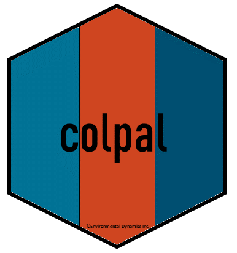
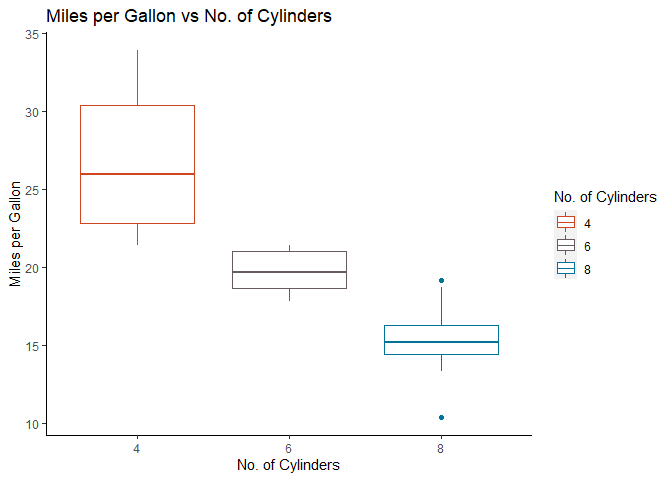

<!-- README.md is generated from README.Rmd. Please edit that file -->

# colpal <a href="https://edynamics.com/"></a>

<!-- badges: start -->

[](https://lifecycle.r-lib.org/articles/stages.html#experimental)
[](https://github.com/arash-shamseddini/colpal/actions/workflows/R-CMD-check.yaml)
<!-- badges: end -->

The goal of colpal is to …

## Installation

You can install the development version of colpal from
[GitHub](https://github.com/) with:

``` r
# install.packages("devtools")
devtools::install_github("arash-shamseddini/colpal")
```

## Example

This is a basic example which shows you how to solve a common problem:

``` r
library(colpal)
library(ggplot2)

# Creating a sample bar plot using edi_cols function
ggplot(mpg, aes(x = class)) + geom_bar(fill = edi_cols("Warm Blue")) + # Using Warm Blue (as EDI Primary color)
  ggtitle("Number of cars in each class") +
  ylab("Count") + xlab("Class") +                                                   
  theme(axis.line = element_line(),   # Removing grids, background color & borders
        panel.grid.major = element_blank(),
        panel.grid.minor = element_blank(),
        panel.border = element_blank(),
        panel.background = element_blank())
```



What is special about using `README.Rmd` instead of just `README.md`?
You can include R chunks like so:

``` r
summary(cars)
#>      speed           dist       
#>  Min.   : 4.0   Min.   :  2.00  
#>  1st Qu.:12.0   1st Qu.: 26.00  
#>  Median :15.0   Median : 36.00  
#>  Mean   :15.4   Mean   : 42.98  
#>  3rd Qu.:19.0   3rd Qu.: 56.00  
#>  Max.   :25.0   Max.   :120.00
```

You’ll still need to render `README.Rmd` regularly, to keep `README.md`
up-to-date. `devtools::build_readme()` is handy for this. You could also
use GitHub Actions to re-render `README.Rmd` every time you push. An
example workflow can be found here:
<https://github.com/r-lib/actions/tree/v1/examples>.
