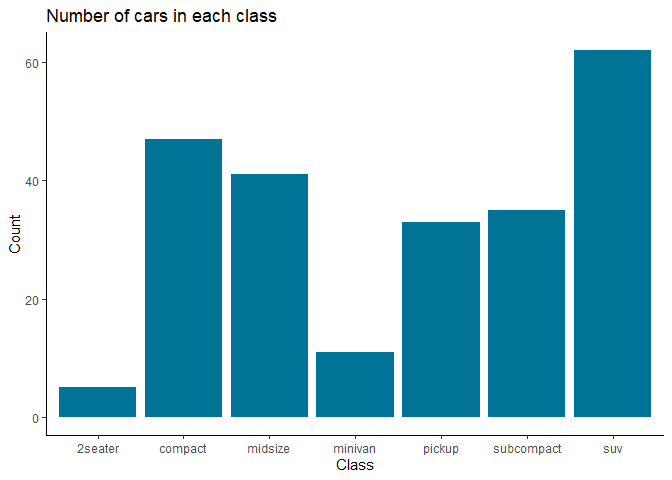

## Welcome to colpal package

At [Environmental Dynamics Inc.](https://edynamics.com/) (EDI) there is
a growing tendency in using R for creating data summary and plotting.
This has been the driving force behind the idea of creating `colpal`. In
a nutshell, `colpal` brings in EDI colors into all the visualizations
within R landscape to not only unify these effort but also help with
EDI’s “Brand Recognition”.

Either you are using [base
R](https://stat.ethz.ch/R-manual/R-devel/library/base/html/00Index.html)
or [ggplot2](https://ggplot2.tidyverse.org/index.html), you can add EDI
corporate color themes with simply a single line of code using `colpal`
functions.

## Installation

You can install the development version of `colpal` from
[GitHub](https://github.com/) with:

``` r
# install.packages("devtools")
devtools::install_github("arash-shamseddini/colpal")
```

## Documentation & Usage

Documentation and usage examples for `colpal` can be found
[here](https://github.com/arash-shamseddini/colpal/tree/main/vignettes).

## Example

This is a basic example which shows you how to solve a common problem:

``` r
library(colpal)
library(ggplot2)

mtcars$cyl <- as.factor(mtcars$cyl)
ggplot(mtcars, aes(x=(cyl), y=mpg, color = cyl)) + 
  geom_boxplot() +
  ggtitle("Miles per Gallon vs No. of Cylinders") + 
  ylab("Miles per Gallon") + 
  xlab("No. of Cylinders") + 
  labs(color="No. of Cylinders") +
  edi_scale_col("mixed", reverse = TRUE)
```



## Code of Conduct

Please note that the `colpal` project is released with a [Contributor
Code of
Conduct](https://contributor-covenant.org/version/2/0/CODE_OF_CONDUCT.html).
By contributing to this project, you agree to abide by its terms.

## Contributors

All contributions are welcome and recognized. Below is the core
contributors to this package.

| Core contributor  | Github.com username            | Affiliation                 |
|-------------------|--------------------------------|-----------------------------|
| Arash Shamseddini | @arash-shamseddini/@arashshams | Environmental Dynamics Inc. |
