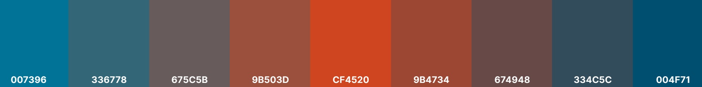
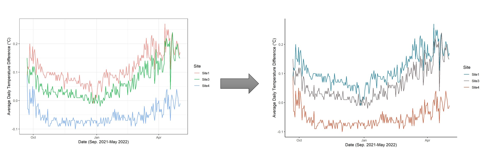

```{r, include = FALSE}
knitr::opts_chunk$set(
  collapse = TRUE,
  comment = "#>"
)
```


```{r setup}
library(colpal)
```

# Introduction

This document is prepared as a brief introduction to building EDI ([Environmental Dynamics Inc.](https://edynamics.com/)) Organizational Color Palette (referred to as OCP hereafter). This record is in core based on the **EDI Color Specifications** which is explained in detail in a document named **"Brand Standards 2017"** that can be found here.


There are lots of reasons to have an OCP in place [@colors-guide]: 

- Consistent colors will help to build a brand and hence more trust. 

- Visualizations will look more consistent no matter which tool you are using to create them.

- You and your team members will be able to think less about colors while creating plots.

<br>
EDI has established three colors to be used for its branding initiatives. The intent is that the colors are consistently and correctly represented given a specific application or general use.

The color specifications are listed in Table 1 and presented in Figure \@ref(fig:edi-standard-colors).

<br>
<br>
<center><p style="font-size:14px">Table 1. Color Specifications</p></center>

|          | Primary - Warm Blue | Secondary - Burnt Orange  | Tertiary – Dark Blue   |
|:--------------|:---------:|:---------:|:-----------:|
| **Pantone**  |  633 |        173  | 3025   |
|**RGB**      |  98, 6, 10, 29   |          207, 69, 32  | 0, 79, 113   |
|**CMYK**      |  0, 115, 150  |          0, 67, 85, 19   | 100, 27, 10, 56    |
|**Hex**      |  #007396   |          #CF4520   | #004F71    |
|**Vinyl**      |  TBD   |          TBD   | TBD    |

<br>


```{r edi-standard-colors, echo=FALSE, fig.align='center', fig.cap='EDI colors (from left to right: Warm Blue, Burnt Orange & Dark Blue)'}

# Embedding image

```


Applying these colors in the visual outputs (e.g. plots prepared for reports) immensely help with EDI **Brand Recognition** [@colors-brand]. 

As there is growing tendency within the company towards producing these visuals using robust tools such as the **R programming language** [@R-intro] (rather than MS Excel) and in particular the **ggplot2** package [@ggplot2-lib], the purpose of this effort is to streamline visualization tasks within the R landscape throughout EDI internal/external correspondences.

# Usage

`colpal` includes four functions, three of which are exported. These functions are demonstrated below with an example using the native `mtcars` data set [@mtcars-intro].

## `edi_cols` (Exported)

This function returns EDI colors (listed in Table 1) as pertinent hex codes. Its application is limited to situations where a single color is to be selected.

It takes the following for the input:

1- **one** of three colors as a **character**:

- "Warm Blue"
- "Burnt Orange"
- "Dark Blue"

and returns the related hex code.

In Figure \@ref(fig:ggplot-ex-1) an example for usage of `edi_cols_fun` with ggplot and in Figure \@ref(fig:base-r-ex-1) an example with base R is demonstrated.


```{r ggplot-ex-1, fig.align='center', fig.cap='Sample ggplot with Burnt Orange'}

# A ggplot example with edi_cols()
ggplot2::ggplot(mtcars, ggplot2::aes(wt, mpg)) + ggplot2::geom_point(colour = edi_cols("Burnt Orange"), size = 5) + 
  ggplot2::ggtitle("Miles per Gallon vs Weight") + ggplot2::ylab("Miles per Gallon") + ggplot2::xlab("Weight (ton)") +
  ggplot2::theme(axis.line = ggplot2::element_line(),   # Removing grid, color & borders
        panel.grid.major = ggplot2::element_blank(),
        panel.grid.minor = ggplot2::element_blank(),
        panel.border = ggplot2::element_blank(),
        panel.background = ggplot2::element_blank())
```


```{r base-r-ex-1, fig.align='center', fig.cap='Sample Base R plot with Warm Blue and Burnt Orange'}

# A Base R example with edi_cols()
plot(x = mtcars$wt, y = mtcars$mpg, pch = 16, col= edi_cols("Warm Blue"),
 xlab = "Weight (ton)",
 ylab = "Miles per Gallon",
 xlim = c(2.5,5),
 ylim = c(15,30),        
 main = "Miles per Gallon vs Weight")
abline(lm(mpg ~ wt, data = mtcars), lwd=2.0, col = edi_cols("Burnt Orange"))
```


## `edi_pal` (Non-exported)

This function technically spits out an interim function which in turn takes the number of levels within the interpolation as the input.

The `edi_pal_fun` takes the following for the input:

1- **One** of the EDI color palettes (e.g. "main", "blue", "mixed") as a **character** 

2- A **boolean** (`reverse = TRUE/FALSE`) for reversing or not reversing the palette

and returns the interim function which takes the following for the input:

1- Number of levels within interpolation (`n`) as a **numeric**

and returns an interpolation of the given palette in form of hex codes.


```{r}

# An example with edi_pal_fun with main palette and 9 levels
edi_pal("main")(9)
```

This interpolation of hex codes belong to an spectrum shown in Figure \@ref(fig:sample-palette-3).

```{r sample-palette-3, echo=FALSE, fig.align='center', fig.cap='Nine shades of "main" palette'}

# Embedding image

```


It should be noted that `edi_pal_fun` is not directly used in the plotting codes and is employed within the following two functions.


## `scale_edi_col` (Exported)

This function constructs a color scale based on the EDI palettes which is in turn is based on the EDI colors. This is only used with a `ggplot` object and is added as an extra layer to the object.

The `scale_edi_col` takes the following for the input:

1- **One** of the EDI color palettes (e.g. "main", "blue", "mixed") as a **character** 

2- A **boolean** (`reverse = TRUE/FALSE`) for reversing or not reversing the palette

3- A **boolean** (`discrete = TRUE/FALSE`) for discrete or continuous color aesthetic

and returns a **color** scale for the input palette. 

In Figure \@ref(fig:ggplot-ex-2) and Figure \@ref(fig:ggplot-ex-3) two examples are demonstrated for `scale_edi_color_fun`.


```{r ggplot-ex-2, fig.align='center', fig.cap='Sample ggplot with "mixed" discrete reversed colored palette'}

# An example with scale_edi_col with mixed discrete palette in reverse order
mtcars$cyl <- as.factor(mtcars$cyl)
ggplot2::ggplot(mtcars, aes(x=(cyl), y=mpg, color = cyl)) + ggplot2::geom_boxplot() +
  ggplot2::ggtitle("Miles per Gallon vs No. of Cylinders") + ggplot2::ylab("Miles per Gallon") + ggplot2::xlab("No. of Cylinders") + ggplot2::labs(color="No. of Cylinders") +
       scale_edi_col("mixed", reverse = TRUE)
```


```{r ggplot-ex-3, fig.align='center', fig.cap='Sample ggplot with "mixed" continuous reversed colored palette'}

# An example with scale_edi_col with mixed continuous palette in reverse order
ggplot2::ggplot(mtcars, aes(wt, mpg, color = disp)) +
  ggplot2::geom_point(shape = 1, size = 5, stroke = 2) + 
  ggplot2::ggtitle("Miles per Gallon vs Weigth & Engine Displacement") + ggplot2::ylab("Miles per Gallon") + ggplot2::xlab("Weigth (ton)") + ggplot2::labs(color = "Engine Displacement (cu. in.)") +
  scale_edi_col("mixed", discrete = FALSE, reverse = TRUE)
```


## `scale_edi_fill` (Exported)

This function constructs a fill scale based on the EDI palettes which is in turn is based on the EDI colors. This is only used with a `ggplot` object and is added as an extra layer to the object.

The `scale_edi_fill` takes the following for the input:

1- **One** of the EDI color palettes (e.g. "main", "blue", "mixed") as a **character** 

2- A **boolean** (`reverse = TRUE/FALSE`) for reversing or not reversing the palette

3- A **boolean** (`discrete = TRUE/FALSE`) for discrete or continuous color aesthetic

and returns a **fill** scale for the input palette. 

In Figure \@ref(fig:ggplot-ex-4) and Figure \@ref(fig:ggplot-ex-5) two examples are demonstrated for `scale_edi_fill_fun`.

```{r ggplot-ex-4, fig.align='center', fig.cap='Sample ggplot with "mixed" discrete reversed filled palette'}

# An example with scale_edi_fill with mixed discrete palette in reverse order
mtcars$cyl <- as.factor(mtcars$cyl)
ggplot2::ggplot(mtcars, aes(x=(cyl), y=mpg, fill = cyl)) + ggplot2::geom_boxplot() +
  ggplot2::ggtitle("Miles per Gallon vs No. of Cylinders") + ggplot2::ylab("Miles per Gallon") + ggplot2::xlab("No. of Cylinders") + ggplot2::labs(fill = "No. of Cylinders") +
       scale_edi_fill("mixed", reverse = TRUE)
```


```{r ggplot-ex-5, fig.align='center', fig.cap='Sample ggplot with "mixed" continuous reversed filled palette'}

# An example with scale_edi_fill with mixed continuous palette in reverse order
ggplot2::ggplot(mtcars, aes(wt, mpg, fill = disp)) +
  ggplot2::geom_point(shape = 21, size = 5) + 
  ggplot2::ggtitle("Miles per Gallon vs Weigth & Engine Displacement") + ggplot2::ylab("Miles per Gallon") + ggplot2::xlab("Weigth (ton)") + ggplot2::labs(fill ="Engine Displacement (cu. in.)") +
  scale_edi_fill("mixed", discrete = FALSE, reverse = TRUE)
```


# A Practical Example

In order to draw a better picture of how EDI OCP can help with streamlining our plotting tasks, an example has been demonstrated in \@ref(fig:comparison-plot). This example is a summary plot borrowed (with permission) from a project I was recently involved in. Plots like this can be seen normally throughout EDI's typical internal/external reports.

On the left-hand side is the plot with R default colors whereas on the right-hand side is the same plot to which EDI OCP has been applied.

```{r comparison-plot, echo=FALSE, fig.align='center', fig.cap='Incorporting EDI OCP into a typical plot'}

# Embedding image

```


Obviously, it is satisfying to be able to bring company's color themes into life with adding **just one line of code**.


# Summary

There are a lot of reasons why we would want to build an OCP to apply to our visualization products, the most important of which is EDI Brand Recognition. This document aims to build this OCP within the R environment and is technically the stepping stone towards packaging the palette.

The expected result is that we will be able to create EDI-themed plots using a single line of code. Imagine how time efficient this application is!


# References
